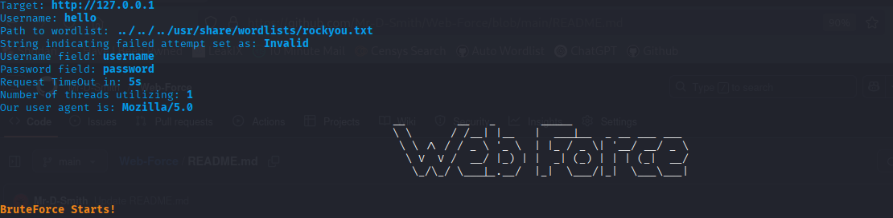

# Web-Force

### DISCLAIMER
**I do not support or promote any kind of unethical activities through this tool. This tool is for authorized testing and educational purposes only.
The developer is not responsible for any misuse**

<br> 
<hr>

**Web Force** is a flexible web application password brute-forcing tool written in Python.

<br>



<hr>
<br>

### It Supports:
- Mutli-threading.
- Support for custom username/password fields.
- **Timeout, User-Agent customization,** and **SSL verification** control.
- **Proxy Support** , both for single proxy and for list of proxies.
- **Logging**

### Libraries Utilized :
- requests
- argparse
- threading
- time
- sys and os
- logging
- random
- pyfiglet and shutil

### Optional Step
**You can make Web Force accessible from anywhere utilizing these commands**
```
mv web_force.py web_force
chmod +x web_force
sudo mv web_force /usr/local/bin
```

### Usage

- Basic Usage
```
python3 web_force.py -t http://target.com -u admin -w passwords.txt
````
or
```
web_force -t http://target.com -u admin -w passwords.txt
```
- With custom Username and Password Fields
```
python3 web_force.py -t http://target.com -u admin -w passwords.txt -uf user -pf pass
````
or
```
web_force -t http://target.com -u admin -w passwords.txt -uf user -pf pass
```
- Using Threads and Proxy
```
python3 web_force.py -t http://target.com -u admin -w passwords.txt --threads 5 --proxy http://127.0.0.1:8080
````
or
```
web_force -t http://target.com -u admin -w passwords.txt --threads 5 --proxy http://127.0.0.1:8080
```
- Detect Success by Redirect Location
```
python3 web_force.py -t http://target.com -u admin -w passwords.txt -r /dashboard
````
- Disabling SSL Verification
```
python3 web_force.py -t http://target.com -u admin -w passwords.txt --no-verify
```
- Enable Logging
```
python3 web_force.py -t http://target.com -u admin -w passwords.txt --log
```

### Working :
1. Reads the wordlist file line-by-line
2. For each password:
   Sends a POST request to the login form with the username and password.
   Determines the success based on:
     Absence of the **faliure string** in the response , or
     Presence of a **redirection location**
3. Supports using multiple threads to speed up the attack
4. Optionally rotates proxies from a provided a list
